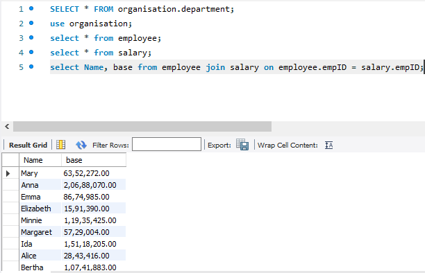
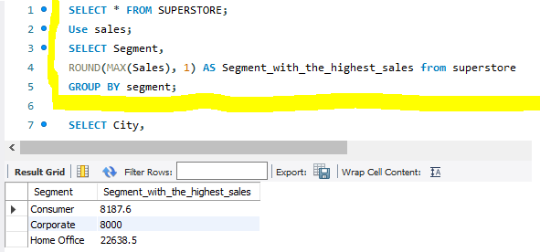
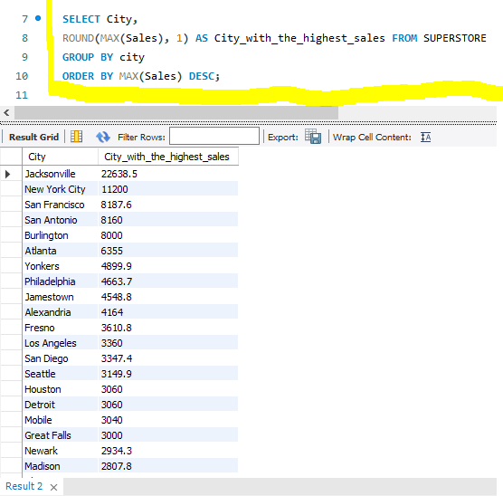

## JOINS AND AGGREGATE FUNCTIONS IN SQL
### Introduction:
Joins are essential for combining data from multiple tables in a relational database and also allows retrieve meaningful information by establishing relationship between tables.While Aggregate functions in SQL are used to perform calculations on sets of values are return a single result.
## Problem Statement:
The task requires that we come up with 4(four) business questions and query the following tables provided below
- JOINS
- GROUP BY
- At least 2 AGGREGATE functions
- ORDER BY
- 
# Generated Questions:

1.Table showing Names and salaries of the Employees?

2.Which are the top 3 Segments with the highest sales ?

3.Which City was the most sales made in ?

4.What is the Averagr profit yearly increment ?
 
## Result/Discussion:
- The table showing the Names and Salaries of the Employees are shown in the snapshot below
- 
- --
- The Top 3 segments with the highest sales are shown in the snapshot below
- 
- --
- The City with the most sales is as seen in the snapshot below
- 
- --
- 
- 
